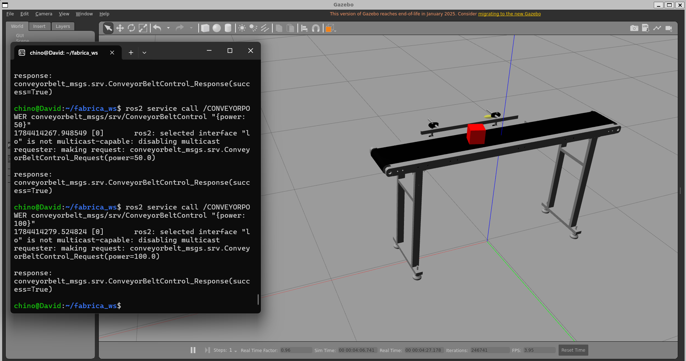

# fabrica_ws

Workspace de **ROS 2** (Humble) para simular una **banda transportadora industrial** en Gazebo Classic: modelo 3D (URDF/xacro), visualización en RViz, física de contacto y control de velocidad de la banda vía un plugin de Gazebo.

<!-- 
  IMAGEN 1: Foto/render general del robot (banda transportadora) en RViz o Gazebo.
  
-->

## Contenido

| Paquete | Tipo | Descripción |
|---|---|---|
| [`src/banda`](src/banda) | `ament_python` (propio) | Modelo xacro/URDF de la banda transportadora, launch files, configuración de RViz y una caja de prueba para verificar la física. |
| [`src/IFRA_ConveyorBelt`](src/IFRA_ConveyorBelt) | submódulo git ([IFRA-Cranfield](https://github.com/IFRA-Cranfield/IFRA_ConveyorBelt)) | Plugin de Gazebo (`ros2_conveyorbelt`) y mensajes/servicios (`conveyorbelt_msgs`) que permiten mover objetos sobre la banda controlando su velocidad por ROS 2. |

### Paquete `banda`

- **`xacro/banda_transportadora.xacro`** — Modelo del robot: cuerpo (`body_link`), patas de soporte (`support_L`/`support_R`), rodillos y banda, con un link `base_footprint` como raíz para que el modelo se apoye correctamente en el piso al spawnear en Gazebo.
- **`xacro/gazebo.xacro`** — Configuración de física para Gazebo (modelo `static`, referencia al plugin de la banda).
- **`xacro/materials.xacro`** — Colores/materiales del modelo.
- **`meshes/`** — Mallas STL de cada pieza (cuerpo, patas, barras, banda).
- **`urdf/test_box.urdf`** — Caja de prueba simple usada para verificar que la banda mueve objetos correctamente.
- **`launch/display.launch.py`** — Lanza `robot_state_publisher` + `joint_state_publisher` (o su versión GUI) + RViz, sin Gazebo, para revisar rápido el modelo y sus TFs.
- **`launch/gazebo.launch.py`** — Lanza Gazebo Classic, spawnea el robot y (opcionalmente) la caja de prueba sobre la banda, con RViz opcional.
- **`rviz/banda.rviz`** — Configuración de RViz (grid, RobotModel, TF).

<!--
  IMAGEN 2: Captura de RViz mostrando el modelo/TFs.
  
-->

<!--
  IMAGEN 3: Captura de Gazebo con la caja de prueba sobre la banda.
  
-->

### Submódulo `IFRA_ConveyorBelt`

Paquete externo (Cranfield University) que provee el plugin de Gazebo `libros2_conveyorbelt_plugin.so`. Permite controlar la velocidad de la banda mediante el servicio ROS 2 `/CONVEYORPOWER` (`conveyorbelt_msgs/srv/ConveyorBeltControl`, potencia de 0 a 100).

## Requisitos

- Ubuntu 22.04 + ROS 2 Humble
- Gazebo Classic (`gazebo_ros`, `gazebo_plugins`)
- `xacro`, `robot_state_publisher`, `joint_state_publisher`, `joint_state_publisher_gui`, `rviz2`

## Instalación

```bash
git clone --recurse-submodules https://github.com/chinoelmocho/fabrica_ws.git
cd fabrica_ws
colcon build
source install/setup.bash
```

> Si ya clonaste el repo sin `--recurse-submodules`, ejecuta:
> ```bash
> git submodule update --init --recursive
> ```

## Uso

Solo visualizar el modelo en RViz (sin física):

```bash
ros2 launch banda display.launch.py
```

Simulación completa en Gazebo (con RViz y caja de prueba):

```bash
ros2 launch banda gazebo.launch.py
```

Argumentos opcionales:

```bash
ros2 launch banda gazebo.launch.py use_rviz:=false spawn_test_box:=false
```

<!--
  IMAGEN 4 (opcional): GIF/captura de la banda moviendo la caja de prueba.
  
-->

## Notas de compatibilidad (WSL2)

Si ejecutas este workspace dentro de WSL2 y `spawn_entity` nunca detecta el servicio `/spawn_entity`, habilita multicast en el loopback:

```bash
sudo ip link set lo multicast on
```

Para que persista entre reinicios, agrega en `/etc/wsl.conf`:

```ini
[boot]
command="ip link set lo multicast on"
```

y ejecuta `wsl --shutdown` desde PowerShell una vez para aplicar el cambio.

## Licencia

`banda` se distribuye bajo licencia [Apache-2.0](src/banda/LICENSE). `IFRA_ConveyorBelt` mantiene su propia licencia (ver el submódulo).
